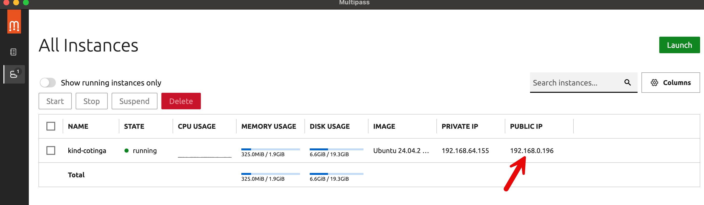
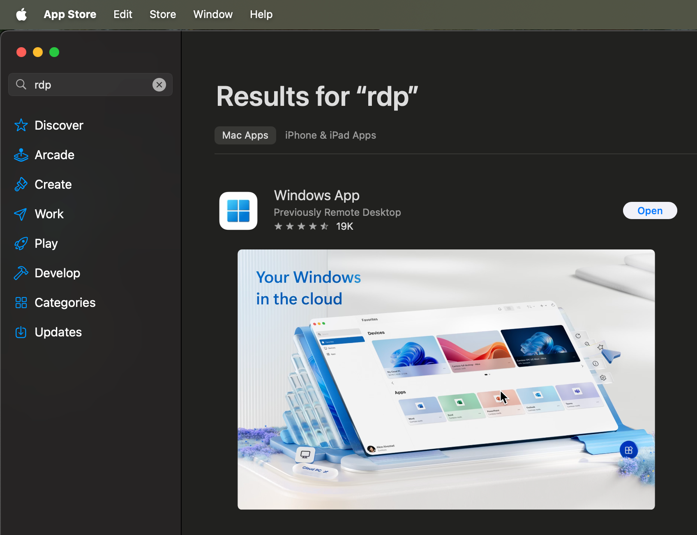
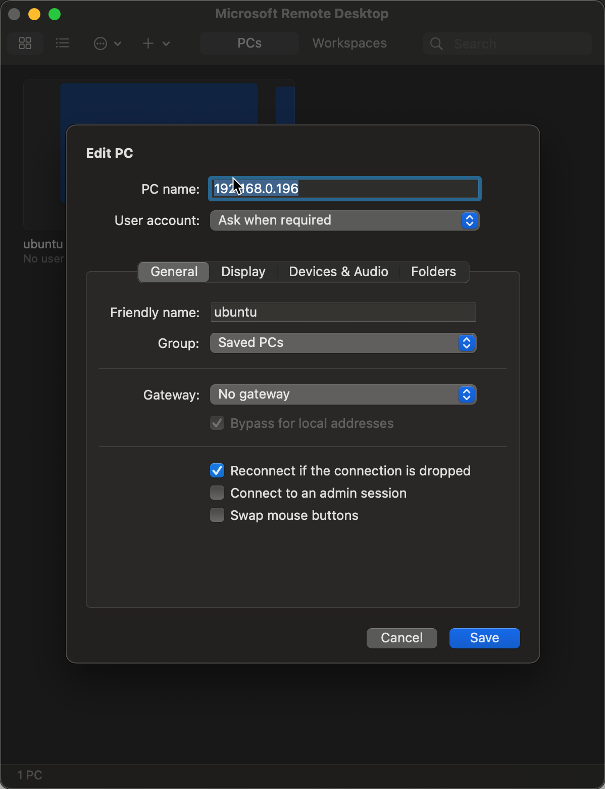
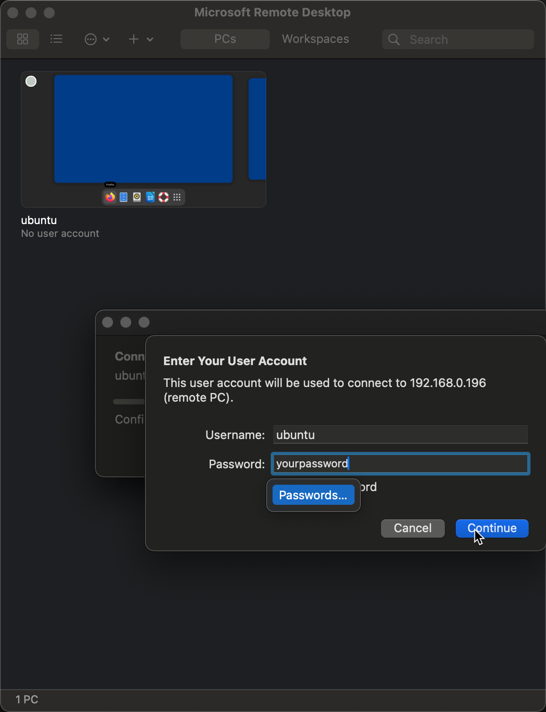
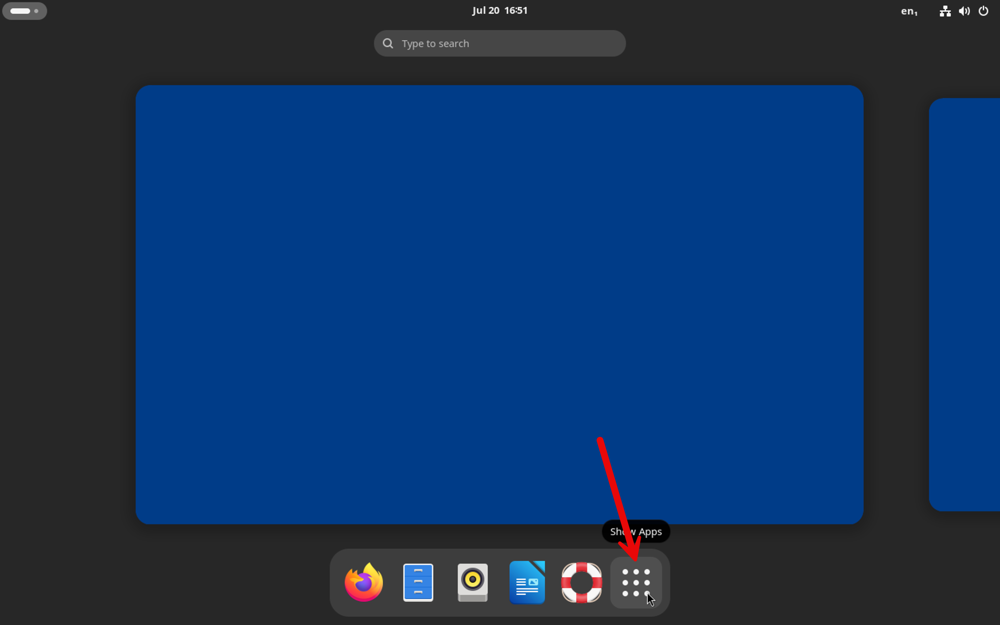
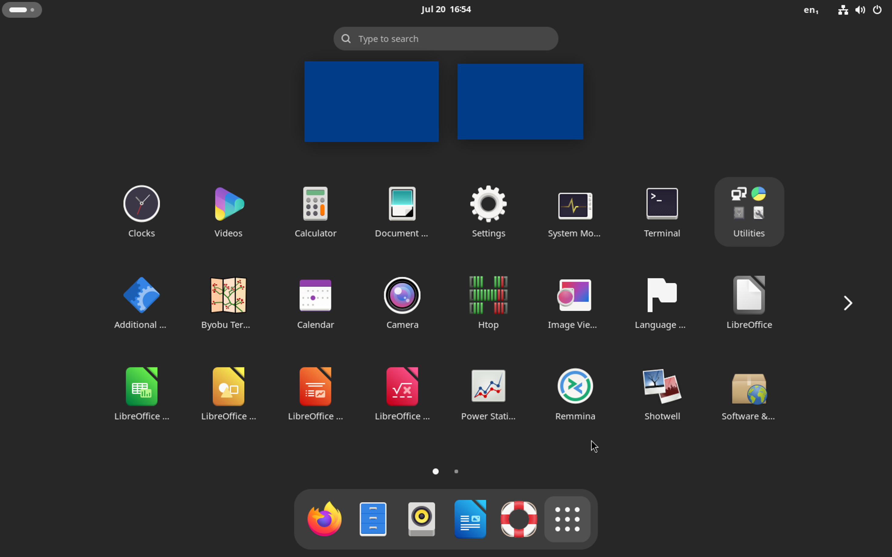

# 🚀 The Fastest Way to Run Ubuntu Desktop on Your Machine with Multipass

## 🌍 Why Ubuntu Desktop?

Ubuntu Desktop is gaining serious traction—especially as countries like [Denmark and Germany transition from Windows to Linux](https://www.zdnet.com/article/the-german-state-schleswig-holstein-uninstalls-windows/). It's a powerful, open-source alternative that comes bundled with a complete suite of productivity apps, making it a great option for work, education, or casual use.

If you’ve ever wanted to spin up a clean, isolated Ubuntu Desktop environment on your machine *in minutes*, Canonical’s **Multipass** tool is your new best friend.

---

## ⚡ Meet Multipass

[Multipass](https://canonical.com/multipass) is a lightweight, command-line tool from Canonical that lets you launch Ubuntu VMs effortlessly. Think of it as a faster, simpler alternative to VirtualBox—purpose-built for Ubuntu and great for local development and testing.

You can install Multipass in just a few clicks by following the instructions on their website.

---

## 🛠️ Automate the Setup with Cloud-Init

By default, Multipass creates minimal Ubuntu Server VMs—no desktop environment included. But we can fix that!

Using a **cloud-init** file, you can automatically install a full Ubuntu Desktop environment and even configure Remote Desktop access. Here’s an example cloud-init file that does exactly that:

```yaml
package_update: true
package_upgrade: true

users:
  - default

chpasswd:
  list: |
    ubuntu:yourpassword   # 🔒 Replace 'yourpassword' with a secure password!
  expire: False

packages:
  - xrdp
  - ubuntu-desktop

# Uncomment to run additional commands after setup:
# runcmd:
#   - echo 'VM setup complete!'
```

---

## 🖥️ Launch Your Desktop VM

Save the above YAML file as `cloud-init.yml` and run:

```bash
multipass launch --memory 2G --disk 20G --cloud-init ./cloud-init.yml --network=bridged
```

This command creates a VM with:

* **Ubuntu Desktop preinstalled**
* **RDP server enabled (via xrdp)**
* **2GB RAM and 20GB disk space** (feel free to adjust)

The `--network=bridged` flag makes the VM access your wifi connection on your host machine to simplify internet access.

---

## 🔌 Connect via RDP

Once your VM is up and running:

1. **Open the Multipass app** to find the VM's **public IP address**
   

2. **Download an RDP client**:

   * Search for “Microsoft Remote Desktop” on the App Store or Microsoft Store
     

3. **Connect to the VM**:

   - Create a new connection using the "+" button;
   - Enter the IP address and login using the credentials from your cloud-init file
     ;
   - Click on the connection just created and enter the password you set in the cloud-init file:
     , then click on "Continue";
    
You should see the desktop setup screen; choose your language and click "Next". Then, you should now see your desktop. Click on the show apps button to see the apps available:





And that’s it! You’ve now got a fully functioning Ubuntu Desktop environment running in a lightweight virtual machine—great for testing, development, or simply exploring Linux.

---

## 🙌 Final Thoughts

Whether you're a developer looking to isolate your work environment, or just curious about trying Ubuntu Desktop without messing up your main OS, this setup offers a fast, clean, and customizable solution.

Let me know if you try it out or have any improvements to suggest!

