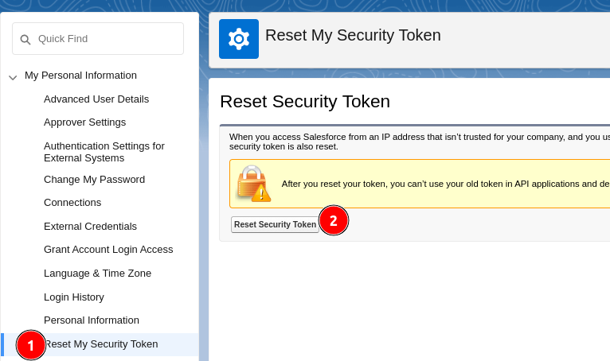
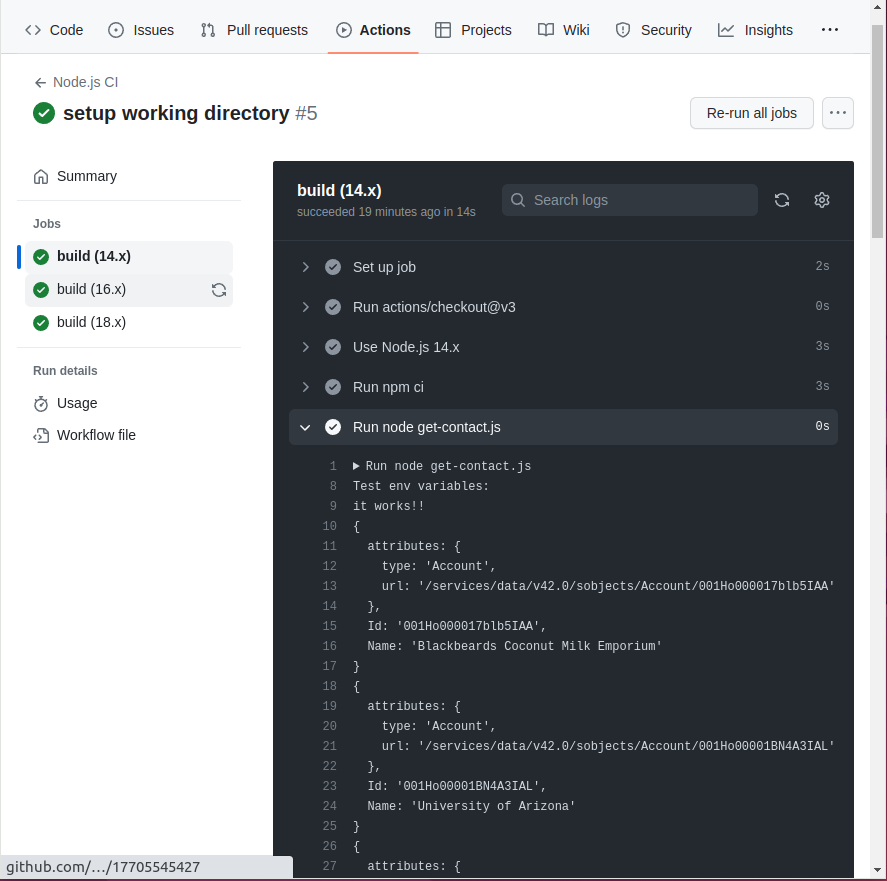

# Synchronize Salesforce Data to Your System

## Introduction

Salesforce is one of the most powerful CRM systems
on the market. This "low-code" platform can replace an entire IT department by offering
a website to manage your clients, your billing, your marketing campaigns,
your field interventions, and much more.

Even though it can manage your entire back office, it can't replace your brand image
or certain systems at the core of your business model.
Integrating Salesforce data is therefore fundamental work to present your customers with
custom products while transferring their data to the CRM to ensure consistency of your
data across your systems.

## Install the Salesforce CLI ("sf")

The first step to working with Salesforce data efficiently
[is installing "sf"](https://developer.salesforce.com/docs/atlas.en-us.sfdx_setup.meta/sfdx_setup/sfdx_setup_install_cli.htm).

This command-line tool will allow you to quickly test your queries to the CRM, for example:

```shell
sf org login web
sf org list
sf data query --query "SELECT Id, Name, Account.Name FROM Contact" -o <ORG_USERNAME>
```

These three commands allow you to connect to your Salesforce instance, view details of
your organization, and finally connect with these details to execute a query. Here's what it looks like on a [developer test instance](https://developer.salesforce.com/signup/):


As you can see, Salesforce does you a favor by creating the instance with prepopulated data.

## Program Synchronization Thanks to Salesforce's REST API

Once you have tested the queries that can be used in your synchronization program with
`sf`, all that's left is to program the code that will execute these queries to perform the synchronization.

Of course, contacting the REST API directly would require recoding the data transfer objects (DTOs), which we
want to avoid. Salesforce provides an excellent NodeJs wrapper (https://github.com/jsforce/jsforce) for its API, and it's the one I recommend
for several reasons:

- [Salesforce recommends this ecosystem](https://developer.salesforce.com/blogs/2021/01/what-is-node-js-and-why-does-it-matter-as-a-salesforce-developer);
- `sf` was coded with NodeJS;
- [It's one of the 2 only wrappers proposed by the system's documentation](https://trailhead.salesforce.com/content/learn/modules/api_basics/api_basics_rest);
- jsforce is maintained by Salesforce unlike other wrappers in other major programming languages (example: https://github.com/simple-salesforce/simple-salesforce)
- The documentation is superior to other wrappers, as you have [a website dedicated to jsforce documentation](https://jsforce.github.io/)

### Example of Data Retrieval with Jsforce

Jsforce will need a "security token" and not just your password to connect to your Salesforce instance.
Navigate to "Setup":

Then create a security token for yourself:


Here is an example code that retrieves contacts from the Salesforce database:

```javascript
var jsforce = require('jsforce');
var username = '<email>';
var securityToken = '<security-token>';
var password = '<password>';
var conn = new jsforce.Connection({
loginUrl : 'https://guillaumeblanchet-dev-ed.develop.my.salesforce.com'
});
conn.login(username, password + securityToken, function(err, res) {
conn.query('SELECT Id, Name FROM Account', function(err, res) {
console.log(res);
});
});
```

You should have something like this in your console:


As you can see, the API returns information for you to paginate requests.
Since we are using a top-tier wrapper, JsForce can manage pagination
itself with the `record' event.

### Example of Firebase <-> Salesforce Synchronization

Here is a more complete example that first destroys the synchronized table in the target system
(here a Firebase database) and then inserts the Salesforce entries one by one:

```javascript
conn.login(username, password + securityToken, (err, res) => {
// clear your synchronized database account table (example with firebase)
firebase.database().ref('account').remove();
var query = conn.query('SELECT Id, Name FROM Account')
.on('record', record => {
console.log(record);
// insert record into your database (example with firebase)
firebase.database().ref('account').push(record);
})
.on('end', () => {
console.log("total in database : " + query.totalSize);
console.log("total fetched : " + query.totalFetched);
})
.run({ autoFetch : true });
});
```

I've deliberately omitted initializing the Firebase connection to extract the relevant code. However,
you can consult the documentation for NodeJS here: https://firebase.google.com/docs/reference/node.

Note the `autoFetch` functionality, which allows for automatic query pagination and demonstrates the utility
of choosing your wrapper well before integrating with Salesforce (or any other system).

### Executing Periodic Synchronization

Of course, you could place the small script above into an Azure Function, an AWS Lambda, or even
a cloud function directly in Firebase to execute it at regular intervals.

Personally, I prefer using a devops job. Indeed, the idea is to continue to benefit from powerful
platforms that do more for us. This is the
case for Devops platforms like Azure Devops, Gitlab, or Github Actions. These platforms do not limit you
in the number of programming languages supported. They offer you a wide range of operating systems to
run your code. They have extremely mature and central interfaces to their core business. They are truly
the best cloud orchestrators on the market, even though they are better known for performing compilation and
deployment tasks.

For example, here is a Github Action job that synchronizes your data at midnight every day (see the documentation for
all supported schedule types: [GitHub Docs](https://docs.github.com/en/actions/using-workflows/events-that-trigger-workflows#schedule)):

```yaml
name: Node.js CI
on:
  schedule:
    - cron: '0 0 * * *' # Run every day at midnight UTC
jobs:
  build:
    runs-on: ubuntu-latest
    defaults:
      run:
        working-directory: ./Salesforce
    strategy:
      matrix:
        node-version: [14.x, 16.x, 18.x]
        # See supported Node.js release schedule at https://nodejs.org/en/about/releases/
    steps:
      - uses: actions/checkout@v3
      - name: Use Node.js ${{ matrix.node-version }}
        uses: actions/setup-node@v3
        with:
          node-version: ${{ matrix.node-version }}
          cache: 'npm'
          cache-dependency-path: ./Salesforce/package-lock.json
      - run: npm ci
      - shell: bash
        env:
          SF_PWD: ${{ secrets.SF_PWD }}
          SF_SECURITY_TOKEN: ${{ secrets.SF_SECURITY_TOKEN }}
          TEST: 'it works!!'
        run: |
          node get-contact.js
```

Github provides access to all synchronization logs made at midnight and you have the ability to retrigger failed jobs
and manage them:



Devops platforms also [provide you with OpenId Connect (OIDC) integrations to avoid managing
secrets (here your password and the security token)](https://docs.github.com/en/actions/deployment/security-hardening-your-deployments/about-security-hardening-with-openid-connect), which cloud functions do not offer.

Devops platforms will also guide you to identify synchronization issues by associating new failed jobs
with the recently committed faulty code. Github will even soon offer you intelligent assistants (bots) to support you
in this debugging.

You can also manage access and permissions of pipelines very precisely.

## Conclusion

You now have the tools to synchronize your Salesforce data with your system:

- you have learned to use the Salesforce CLI to test your queries;
- you have learned to use the Jsforce wrapper to program your synchronization;
- you have learned to use Devops platforms to orchestrate your synchronization.

If the load becomes too high in your synchronizations, you can revert to custom pagination
to load data batches into your
database with a "bulk insert" strategy. For firebase, it could be something like this:

```javascript
firebase.database().ref('account').set(records);
```
This is equivalent to replacing the entire contact data table at once for an initial batch of `records` as a parameter.

Note that we have only discussed synchronization towards your system and not towards Salesforce. If we wanted
to push new data towards Salesforce this time, we could use the same wrapper, because Jsforce offers
a "bulk insert" feature to push multiple entries efficiently for large systems: [Jsforce Documentation](https://jsforce.github.io/document/#bulk-api).

## References

- https://jsforce.github.io/
- https://developer.salesforce.com/docs/atlas.en-us.sfdx_cli_reference.meta/sfdx_cli_reference/cli_reference_unified.htm
- https://trailhead.salesforce.com/content/learn/modules/api_basics/api_basics_rest
