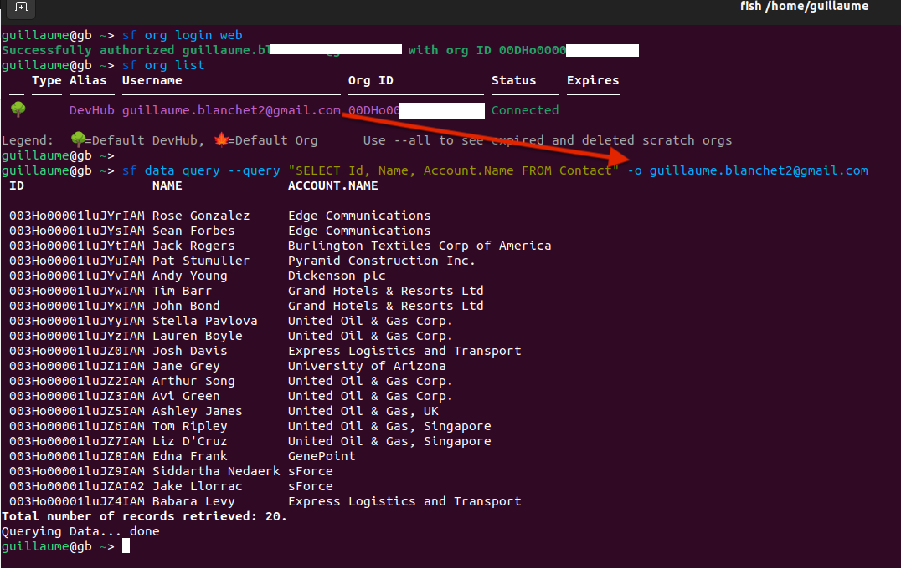
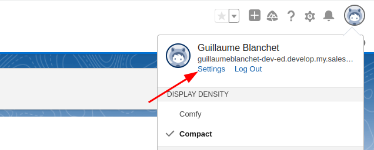
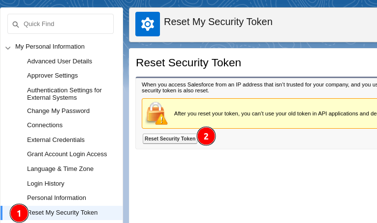
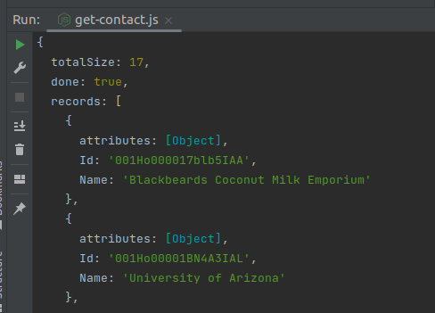
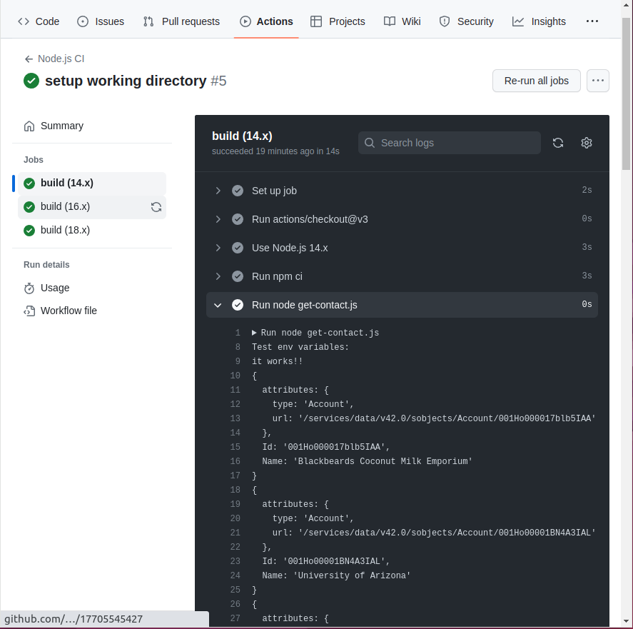

# Synchroniser les données Salesforce vers votre système 

## Introduction

Salesforce est une des systèmes CRM les plus puissantes
sur le marché. Cette plateforme "low-code" peut remplacer un département TI au complet en offrant 
un site web permettant de gérer vos clients, votre facturation, vos campagnes marketing,
vos interventions sur le terrain, et bien plus.

Même s'il peut gérer tout votre "back office", il ne pourra pas remplacer votre image 
de marque ou certains de vos systèmes au coeur de votre modèle d'affaire.
L'intégration des données Salesforce est donc un travail fondamental pour présenter à vos clients des
produits sur mesures tout en transférant leurs données au CRM pour assurer la cohérence de votre 
donnée dans vos systèmes.

## Installer le Salesforce CLI ("sf")

La première étape pour travailler avec la donnée Salesforce efficacement 
[est d'installer "sf"](https://developer.salesforce.com/docs/atlas.en-us.sfdx_setup.meta/sfdx_setup/sfdx_setup_install_cli.htm).

Cet outil en ligne de commande vous permettra de tester rapidement vos requêtes au CRM, exemple:

    sf org login web
    sf org list
    sf data query --query "SELECT Id, Name, Account.Name FROM Contact" -o <ORG_USERNAME>

Ces trois commandes vous permettent de vous connecter à votre instance Salesforce, de consulter les détails de
votre organisation et enfin de vous connecter avec ces détails pour exécuter une requête. Voici sur une instance de tests 
[developpeur](https://developer.salesforce.com/signup/) ce que ça donne:



Comme on voit, Salesforce vous rend service en créant l'instance avec de la donnée déjà prépopulée. 

## Programmer la synchronisation grâce au REST API de Salesforce

Un fois que vous avez testé les requêtes qui pourront être utilisées dans votre programme de synchronisation avec 
`sf`, il ne vous reste plus qu'à programmer le code qui exécutera ces requêtes pour opérer la synchronisation.

Évidemment, contacter le REST API directement demanderait de recoder les objets de données de transfert (DTOs), ce qu'on 
veut éviter. Salesforce fournit un excellent wrapper NodeJs (https://github.com/jsforce/jsforce) pour son API et c'est celui que je vous conseille 
pour plusieurs raisons:

- [Salesforce recommande cet écosystème](https://developer.salesforce.com/blogs/2021/01/what-is-node-js-and-why-does-it-matter-as-a-salesforce-developer);
- `sf` a été codé avec NodeJS;
- [C'est un des 2 seuls wrappers proposés par la documentation du système](https://trailhead.salesforce.com/content/learn/modules/api_basics/api_basics_rest);
- jsforce est maintenu par Salesforce contrairement à d'autres wrappers dans les autres langages de programmation importants (exemple: https://github.com/simple-salesforce/simple-salesforce)
- la documentation est supérieure aux autres wrappers, car vous avez [un site dédiée à la doc de jsforce](https://jsforce.github.io/)

### Exemple d'obtention de données avec Jsforce

Jsforce aura besoin d'un "security token" et non seulement de votre mot de passe pour se connecter à votre instance Salesforce.
Dirigez-vous dans "Setup":

Ensuite créez-vous un token de sécurité:


Voici un exemple de code qui va chercher les contacts dans la base de données Salesforce:

```
var jsforce = require('jsforce');
var username = '<email>';
var securityToken = '<security-token>';
var password = '<password>';
var conn = new jsforce.Connection({
    loginUrl : 'https://guillaumeblanchet-dev-ed.develop.my.salesforce.com'
});
conn.login(username, password + securityToken, function(err, res) {
    conn.query('SELECT Id, Name FROM Account', function(err, res) {
        console.log(res);
    });
});
```

Vous devriez avoir quelque chose comme ceci dans votre console:



Comme vous pouvez voir, l'API retourne des informations pour que vous paginiez les requêtes. 
Comme nous sommes sur un wrapper de premier ordre, JsForce peut gérer lui-même la pagination
avec l'événement `record'.

### Exemple de synchronisation Firebase <-> Salesforce

Voici un exemple plus complet qui détruit d'abord la table synchronisée dans le système cible 
(ici une base de donnée de Firebase) puis insère un à un les entrées de Salesforce:

```
conn.login(username, password + securityToken, (err, res) => {
    // clear your synchronized database account table (example with firebase)
    firebase.database().ref('account').remove();
    var query = conn.query('SELECT Id, Name FROM Account')
        .on('record', record => {
            console.log(record);
            // insert record into your database (example with firebase)
            firebase.database().ref('account').push(record);
        })
        .on('end', () => {
            console.log("total in database : " + query.totalSize);
            console.log("total fetched : " + query.totalFetched);
        })
        .run({ autoFetch : true });
});
```

J'ai volontairement omis l'initialisation de la connection Firebase pour extraire le code pertinent. Par contre,
vous pouvez consulter la documentation pour NodeJS ici: https://firebase.google.com/docs/reference/node.

Vous pouvez noter la fonctionalité `autoFetch` qui permet de paginer automatiquement les requêtes et qui démontre l'utilité
de bien choisir son wrapper avant de s'intégrer avec Salesforce (ou tout autre système).

### Exécution de la synchronisation périodique

Vous pourriez bien sûr mettre le petit script ci-dessus dans une Azure Function, une AWS Lambda ou encore
une cloud function directement dans Firebase pour l'exécuter à intervalles réguliers. 

Personnellement, je préfère utiliser une job devops. En effet, l'idée est de continuer de profiter de puissantes 
plateformes qui en font plus pour nous. C'est le 
cas des plateformes Devops comme Azure Devops, Gitlab ou encore Github Actions. Ces plateformes ne vous limitent pas 
dans la quantité de langages de programmation supportés. Elle vous offre un large éventail de système d'exploitation pour
exécuter votre code. Elles ont des interfaces extrêmement matures et centrales à leur core business. Ce sont en vérité
les meilleurs orchestrateurs clouds sur le marché, même s'ils sont mieux connus pour l'exécution de tâches de compilation et
de déploiement.

Par exemple, voici une job Github Action qui synchronise votre données à minuit tous les jours (voir la documentation pour 
tous les types cédules supportées: https://docs.github.com/en/actions/using-workflows/events-that-trigger-workflows#schedule):

```
name: Node.js CI

on:
  schedule:
    - cron: '0 0 * * *'  # Run every day at midnight UTC

jobs:
  build:
    runs-on: ubuntu-latest
    defaults:
      run:
        working-directory: ./Salesforce
    strategy:
      matrix:
        node-version: [14.x, 16.x, 18.x]
        # See supported Node.js release schedule at https://nodejs.org/en/about/releases/
    steps:
    - uses: actions/checkout@v3
    - name: Use Node.js ${{ matrix.node-version }}
      uses: actions/setup-node@v3
      with:
        node-version: ${{ matrix.node-version }}
        cache: 'npm'
        cache-dependency-path: ./Salesforce/package-lock.json
    - run: npm ci
    - shell: bash
      env:
        SF_PWD: ${{ secrets.SF_PWD }}
        SF_SECURITY_TOKEN: ${{ secrets.SF_SECURITY_TOKEN }}
        TEST: 'it works!!'
      run: |
        node get-contact.js
```

Github donne accès à tous les logs de synchronisation fait à minuit et vous avez la possibilité de redéclencher des jobs 
en échec et de les gérer :



Les plateformes Devops vous [offrent également des intégrations OpenId Connect (OIDC) pour vous éviter de gérer les 
secrets (ici votre mot de passe et le security token)](https://docs.github.com/en/actions/deployment/security-hardening-your-deployments/about-security-hardening-with-openid-connect), ce que les fonctions cloud n'offrent pas.

Les plateformes devops vont aussi vous guider à identifier les problèmes de synchronisation en associant les nouvelles jobs en échec
au code récemment commité fautif. Github vous offrira même bientôt des assistants intelligents (bot) pour vous épauler 
dans ce débogage.

Vous pouvez également gérer l'accès et les permissions des pipelines de façon très précise.

## Conclusion

Vous avez maintenant les outils pour synchroniser vos données Salesforce avec votre système:

- vous avez appris à utiliser le CLI Salesforce pour tester vos requêtes;
- vous avez appris à utiliser le wrapper Jsforce pour programmer votre synchronisation;
- vous avez appris à utiliser les plateformes Devops pour orchestrer votre synchronisation.

Si la charge devient trop importante dans vos synchronisations, vous pourrez retourner à une pagination personnalisée 
pour charger dans votre
base des lots de données avec une stratégie "bulk insert". Pour firebase ce pourrait être quelque chose comme ceci :

```
firebase.database().ref('account').set(records);
```
Ce qui revient à remplacer la table de données contact au complet et d'un coup pour un premier lot de `records` en paramètre. 

Notez que nous avons traité seulement de la synchronisation vers votre système et non vers Salesforce. Si nous voulions 
pousser de la donnée nouvelle vers Salesforce cette fois, nous pourrions utiliser le même wrapper, car Jsforce offre
une fonctionalité de "bulk insert" pour pousser plusieurs entrées efficacement pour de larges systèmes: 
https://jsforce.github.io/document/#bulk-api.

## Références

- https://jsforce.github.io/
- https://developer.salesforce.com/docs/atlas.en-us.sfdx_cli_reference.meta/sfdx_cli_reference/cli_reference_unified.htm
- https://trailhead.salesforce.com/content/learn/modules/api_basics/api_basics_rest


